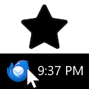

# [Close to Tray](https://addons.thunderbird.net/thunderbird/addon/close-to-tray/)

A Thunderbird extension that moves the main window to the tray when you close it.

* Prevents you from accidentally quitting Thunderbird
* `X` moves the window to the tray, `_` minimizes it – just like Discord
* Doesn't hide your window when you press "Show desktop"
* Choose "Exit" from the hamburger menu or use a keyboard shortcut to quit

Close to Tray works with Linux when combined with [Betterbird](https://www.betterbird.eu/). If you wish to use Close to Tray with Betterbird, **you must download a Betterbird-enabled version of Close to Tray** from the [releases tab](https://github.com/Lachcim/thunderbird-close-to-tray/releases).

## Close to Tray vs alternatives

|   | `_` button / `Win+D` | `X` button |
| - | -------------------- | ---------- |
| Vanilla Thunderbird | Minimize | Quit
| When Thunderbird is minimized, move it to the tray | Move to tray | Quit
| [Minimize on Close](https://github.com/rsjtdrjgfuzkfg/thunderbird-minimizeonclose) | Minimize | Minimize |
| [Minimize on Close](https://github.com/rsjtdrjgfuzkfg/thunderbird-minimizeonclose) +  When Thunderbird is minimized, move it to the tray | Move to tray | Move to tray |
| **Close to Tray** | Minimize | Move to tray |

## Close to Tray and Linux

Thunderbird on Linux lacks tray support. [Betterbird](https://www.betterbird.eu/) is a Thunderbird fork that supports the tray. Close to Tray works with Betterbird version 102.15.1 or newer.

If you wish to use Close to Tray with Betterbird, you must download a Betterbird-enabled version of Close to Tray from the [releases tab](https://github.com/Lachcim/thunderbird-close-to-tray/releases). The version of Close to Tray hosted on [addons.thunderbird.net](https://addons.thunderbird.net/thunderbird/addon/close-to-tray/) does not support Betterbird. This is because Mozilla's Thunderbird extension review policy forbids promoting third-party products.

Close to Tray is confirmed to work with KDE, Gnome, Pop Gnome, Mate and XFCE. If you believe your desktop environment is supported, adjust `mail.minimizeToTray.supportedDesktops`. If your desktop environment is not being detected, add `no-DE` to the list of environments configured in the setting.

## Start in Tray

Close to Tray comes with a sister extension, Start in Tray. Start in Tray moves the main window to the tray when Thunderbird is launched.

Start in Tray on Linux is subject to the same caveats and limitations as Close to Tray. If you wish to use Start in Tray with Betterbird, you must download a Betterbird-enabled version of Start in Tray from the [releases tab](https://github.com/Lachcim/thunderbird-close-to-tray/releases).

## Build instructions

Run `make.py`. This will generate several .xpi files. The ones whose name ends with `betterbird` support Betterbird, the other ones don't.

To install an addon in Thunderbird, go to `Add-ons and Themes > Cog > Install Add-on From File...` and choose one of the generated .xpi files.
